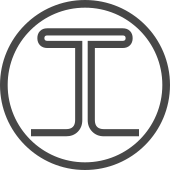

<!-- PROJECT LOGO -->
<br />
<div align="center">
  <a href="https://github.com/GustavoM01/fullstack-health-app">
    
  </a>

  <h3 align="center">Trummy: food intolerance tracker</h3>

  <p align="center">
    A simple app to track meals and symptoms and figure which ingredients might be causing intolerance.
  </p>
</div>


<!-- TABLE OF CONTENTS -->
<details>
  <summary>Table of Contents</summary>
  <ol>
    <li>
      <a href="#about-the-project">About The Project</a>
      <ul>
        <li><a href="#built-with">Built With</a></li>
      </ul>
    </li>
    <li>
      <a href="#getting-started">Getting Started</a>
      <ul>
        <li><a href="#prerequisites">Prerequisites</a></li>
      </ul>
    </li>
    <li><a href="#usage">Usage</a></li>
    <li><a href="#roadmap">Roadmap</a></li>
    <li><a href="#contributing">Contributing</a></li>
    <li><a href="#license">License</a></li>
    <li><a href="#contact">Contact</a></li>
    <li><a href="#acknowledgments">Acknowledgments</a></li>
  </ol>
</details>


<!-- ABOUT THE PROJECT -->
## About The Project


This app aims to provide help to people with food intolerances. It displays a simple way to keep track of what you eat and cross-reference it with symptoms, figuring out what makes you sick.

<p align="right">(<a href="#top">back to top</a>)</p>


### Built With

This section should list any major frameworks/libraries used to bootstrap your project. Leave any add-ons/plugins for the acknowledgements section. Here are a few examples.

* [Angular](https://angular.io/)
* [Spring](https://spring.io/)
* [Bootstrap](https://getbootstrap.com)
* [TypeScript](https://www.typescriptlang.org/)

<p align="right">(<a href="#top">back to top</a>)</p>


<!-- GETTING STARTED -->
## Getting Started

To run the app just clone the project and run it in your prefered IDE.

### Prerequisites

On the Angular project remember to run `npm install` to get all the required modules
* npm
  ```sh
  npm install 
  ```

  On the Spring microservices run in in your IDE or use the ./mvnw command with spring-boot:run.
  You can check all services are running going to localhost:8000.

<!-- USAGE EXAMPLES -->
## Usage

Run `ng serve` on the Angular project and go to localhost:4200 on your browser.
Feel free to explore the application. 

<p align="right">(<a href="#top">back to top</a>)</p>


<!-- ROADMAP -->
## Roadmap

- [ ] Add login feature
- [ ] Multi-language Support
    - [ ] Spanish


<p align="right">(<a href="#top">back to top</a>)</p>


<!-- CONTRIBUTING -->
## Contributing

1. Fork the Project
2. Create your Feature Branch (`git checkout -b feature/AmazingFeature`)
3. Commit your Changes (`git commit -m 'Add some AmazingFeature'`)
4. Push to the Branch (`git push origin feature/AmazingFeature`)
5. Open a Pull Request

<p align="right">(<a href="#top">back to top</a>)</p>

<!-- CONTACT -->
## Contact

Gustavo Maldonado - [GustavoM01](https://github.com/GustavoM01) - maldonadogustavo55@gmail.com

Project Link: [https://github.com/GustavoM01/fullstack-health-app](https://github.com/GustavoM01/fullstack-health-app)

<p align="right">(<a href="#top">back to top</a>)</p>


<!-- ACKNOWLEDGMENTS -->
## Acknowledgments


* [Ironhack Team](https://www.ironhack.com/en)


<p align="right">(<a href="#top">back to top</a>)</p>

